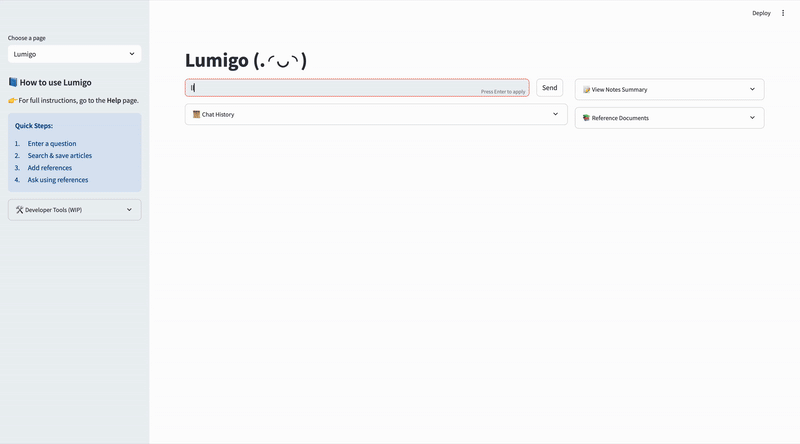

<a name="readme-top"></a>

<h1 align="center"> Lumigo: A Q&A Chatbot for Academic Document Exploration </h1>

<p align="center">
    <a href="https://github.com/FlagOpen/FlagEmbedding">
            
    </a>
    <a href="https://github.com/stephanie0324/Lumigo/stargazers">
        
    </a>
    <a href="https://github.com/stephanie0324/Lumigo/forks">
        
    </a>
    <a href="https://github.com/stephanie0324/Lumigo/issues">
        
    </a>
    <a href="https://github.com/stephanie0324/Lumigo/tree/main?tab=readme-ov-file#MIT-1-ov-file">
        
    </a>
</p>
<div align="center">

  <p>This is a chatbot built with Retrieval-Augmented Generation (RAG) for in-depth semantic search across research papers and theses.</p>

  <p>Ask freely — Lumigo will return grounded answers with trusted reference documents.</p>

  <p>
    🌐 <a href="https://dcce-123-192-82-141.ngrok-free.app" target="_blank"><strong>Live Demo</strong></a>
  </p>

  <br>

  <h4>
    <a href="#about-the-project">About</a> |
    <a href="#new-updates">News</a> |
    <a href="#project-lists">Projects</a> |
    <a href="#getting-started">Getting Started</a> |
    <a href="#usage">Usage</a> |
    <a href="#roadmap">Roadmap</a> |
    <a href="#contributing">Contributing</a> |
    <a href="#license">License</a>
  </h4>

</div>

# About the project

> 🔍 Tech Stack  
>  Built with Streamlit, LangChain, MongoDB, and Google Vertex AI.

**Lumigo** is an intelligent academic research assistant powered by Retrieval-Augmented Generation (RAG). Designed for precision and explainability, it helps users **search**, **explore**, and **question academic documents** with context awareness.

Unlike generic RAG systems, Lumigo supports document-specific queries, generates **follow-up questions**, and provides transparent source attribution for all responses. Leveraging **MongoDB**, **HuggingFace Embeddings**, and **Vertex AI**, it delivers semantically grounded insights through a clean, interactive UI.

Lumigo is ideal for researchers, students, and professionals navigating complex literature with a focus on rigor and clarity.

It leverages:

🗃️ MongoDB for document storage and vector search  
🌐 HuggingFace Embeddings for semantic search  
🤖 Vertex AI for LLM-based summarization and QA  
🚀 GitLab for CI/CD, automates testing and deployment.

<div align="center">
  <p class="image-cropper">
    
  </p>
  <em>Lumigo Interface</em>
</div>

| Area                       | Description                                                                                                                |
| -------------------------- | -------------------------------------------------------------------------------------------------------------------------- |
| 🔍 **Search Panel**        | Input your research question to perform **semantic academic search** across indexed papers.                                |
| 📚 **Source Documents**    | Displays retrieved academic documents with **LLM-generated summaries** and an “Add to Ref” button for selective reference. |
| 📌 **Reference Docs**      | Lists documents you've selected as references. These are used to generate answers and offer **traceable, cited content**.  |
| ❓ **Follow-up Questions** | Suggests relevant follow-up research questions based on your current query and selected references.                        |

## ✨ Key Features

- **Document Ingestion Module**: Supports loading academic documents in JSON and PDF formats. Upon ingestion, documents undergo chunking based on fixed character counts to create manageable text segments.
- **Metadata Tagging Module**: Enriches each text chunk with relevant metadata, including document title, section headers, file source, and author details, enabling precise context retrieval and transparent source attribution.
- **Summarization Module**: Utilizes Vertex AI large language models to generate concise summaries for each chunk, improving document preview capabilities and supporting efficient user exploration.
- **Embedding and Indexing Module**: Employs HuggingFace embedding models to convert each chunk into dense semantic vectors. These embeddings, alongside metadata, are stored in MongoDB Atlas configured with vector search indexes. This supports rapid similarity queries that drive Lumigo’s semantic search.

- **Retrieval-Augmented Generation (RAG) Module**: Combines retrieved document chunks with large language models to generate contextually grounded, explainable answers. Users can interactively select which reference documents to include, ensuring transparency and control over the sources informing responses.

<p align="center">

<br> The Implementation of RAG </br>

- **User Interface Module**: Provides a responsive, user-friendly frontend where users can perform semantic searches, view document previews and summaries, manage reference documents, and pose targeted questions. The interface emphasizes clarity and traceability, with explicit source citations for all generated answers.
- **CI/CD Pipeline**: GitLab pipelines automate testing, building, and deployment, ensuring continuous integration and delivery for robust development workflows.

---

# New Updates

> 🎉 　 Lumigo is born on May 21, 2025

- 2025/06/15 Add in **Multi-Agent** worflow for better search and query expand experience
- 2025/06/05 Add in Vertex AI as our model inference
- 2025/05/27 Lumigo added pdf reader, fooenote and reference for better search

<p align="right">(<a href="#readme-top">back to top</a>)</p>

## 🚀 Getting Started

1. Clone the repository:

   ```bash
   git clone git@gitlab.com:sc310542-group/Lumigo.git
   cd Lumigo
   ```

2. Install dependencies:

   ```bash
   bash script/build-docker-image.sh
   ```

3. Set up your `.env` file:

   - The `.env` file is under `deploy/` folder
   - Fill in the required keys:
     - `MONGODB_URI`
     - `MONGODB_NAME`
     - `COLLECTION`
     - `INDEX_NAME`
     - `OPENAI_API_KEY`
     - `VERTEX_PROJECT_ID`
     - `VERTEX_LOCATION`
     - `VERTEX_MODEL_NAME`
     - `GOOGLE_APPLICATION_CREDENTIALS` (credential filepath)

4. Launch the app:

   ```bash
   cd deploy
   docker-compose up -d

   # for development
   bash script/run-dev-mode.sh
   streamlit run app.py --server.port=7860
   ```

   > [! Note]
   > Prod Mode (docker compose): the credential.json should be in the `deploy/` folder
   > Dev Mode: the credential file under `app/` folder

---

## 🛠️ How to Use

1. **Search for academic content**  
   Enter your question in the search panel. The system performs semantic search over ingested JSON/PDF documents.

2. **Explore and select references**  
   Browse the retrieved documents and their AI-generated summaries. Choose relevant ones by clicking **"Add to Ref"**.

3. **Ask your question**  
   With references selected, ask a question. The system uses only those documents to generate accurate, grounded answers.

4. **View source and follow-ups**  
   Check the sources of the answer, and explore suggested follow-up questions to continue your research.

This tool is designed to support **academic knowledge exploration**, giving you control over your sources and transparent references.

<p align="right">(<a href="#readme-top">back to top</a>)</p>

<!-- LICENSE -->

# License

Distributed under the MIT License. See `LICENSE.txt` for more information.

<p align="right">(<a href="#readme-top">back to top</a>)</p>

## Other Projects

- [Microsoft 2025 LLM Agent Hackathon](https://github.com/stephanie0324/llm-agent-hack)
- [LLM-RAG-UniApply](https://github.com/stephanie0324/LLM_RAG_UniApply)
- [LLM_Projects](https://github.com/stephanie0324/LLM_Projects)

<p align="right">(<a href="#readme-top">back to top</a>)</p>

<h3 align="left">Connect with me:</h3>
<p align="left">
<a href="https://github.com/stephanie0324/" target="blank"></a> <a href="https://www.facebook.com/profile.php?id=100005029028402&locale=zh_TW" target="blank"></a>
<a href="https://www.linkedin.com/in/stephanie-chiang-42100b165/" target="blank"></a>
<a href="https://www.instagram.com/yrs_2499?igsh=MXJ5MHNpc2ZxNHh5NA%3D%3D&utm_source=qr" target="blank"></a>
<a href="https://www.youtube.com/channel/UCpIrOv7O2R7HfpCEMQEOOKQ" target="blank"></a>
</p>
